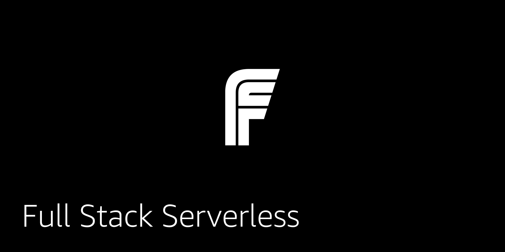

# Full Stack Serverless

Full Stack Serverless is a group of full stack cloud applications that follow the [Full Stack Serverless philosophy](https://github.com/full-stack-serverless/manifesto).

Full Stack Serverless applications combine the following four things:

1. Client-side code
2. Infrastructure as code
3. Numbers 1 and 2 are integrated for an end to end application / solution
4. Heavy use of Serverless technologies and managed services

In this way developers are able to clone, deploy, iterate on, and share end to end solutions that combine both the front end as well as a real scalable back end. These applications should only take moments to deploy and should not have much dependency on the developer's local environment.

Applications from any cloud provider are welcome and encouraged.

## CDK

[CDK Chat App](https://github.com/full-stack-serverless/cdk-appsync-chat)

[CDK Authentication](https://github.com/full-stack-serverless/cdk-authentication)

## Amplify

[Amplify Chat App](https://github.com/full-stack-serverless/react-chat-app-aws)

[Amplify Authentication](https://github.com/full-stack-serverless/react-custom-authentication-aws)